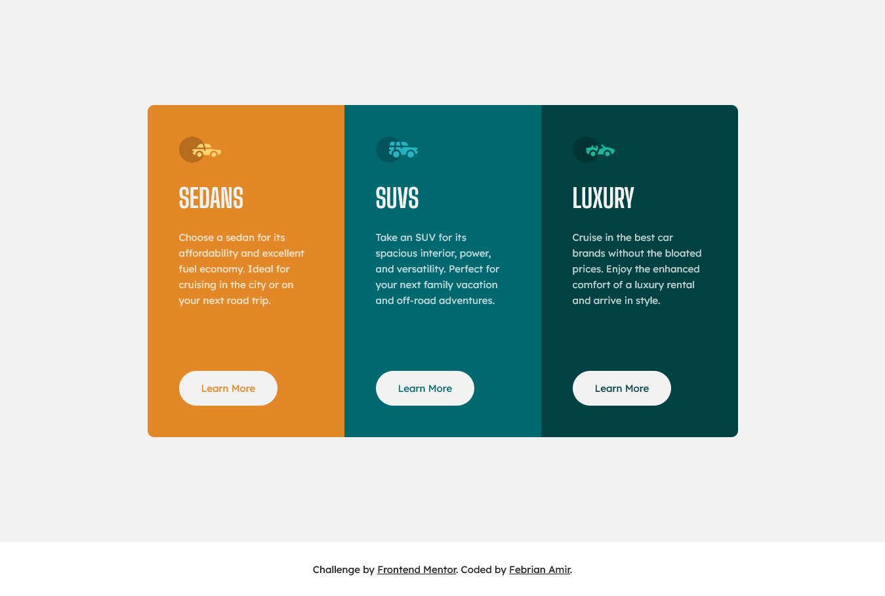

# Frontend Mentor - 3-column preview card component solution

This is a solution to the [3-column preview card component challenge on Frontend Mentor](https://www.frontendmentor.io/challenges/3column-preview-card-component-pH92eAR2-). Frontend Mentor challenges help you improve your coding skills by building realistic projects. 

## Table of contents

- [Overview](#overview)
  - [The challenge](#the-challenge)
  - [Screenshot](#screenshot)
  - [Links](#links)
- [My process](#my-process)
  - [Built with](#built-with)
  - [What I learned](#what-i-learned)
- [Author](#author)

## Overview

### The challenge

Users should be able to:

- View the optimal layout depending on their device's screen size
- See hover states for interactive elements

### Screenshot



### Links

- Solution URL: [Solution URL](https://www.frontendmentor.io/solutions/3column-preview-card-with-flexbox-and-media-queries-gWtPLXE0N)
- Live Site URL: [Live Site URL](https://quikzens.github.io/3-column-preview-card/)

## My process

### Built with

- Semantic HTML5 markup
- CSS custom properties
- Flexbox
- Mobile-first workflow

### What I learned

Use `user-select: none;` for button and icon, because it's cool:

```css
.card__icon,
.card__cta {
  user-select: none;
}
```

## Author

- Website - [Febrian Amir](https://quikzens.netlify.app)
- Frontend Mentor - [@quikzens](https://www.frontendmentor.io/profile/daengkoding)
