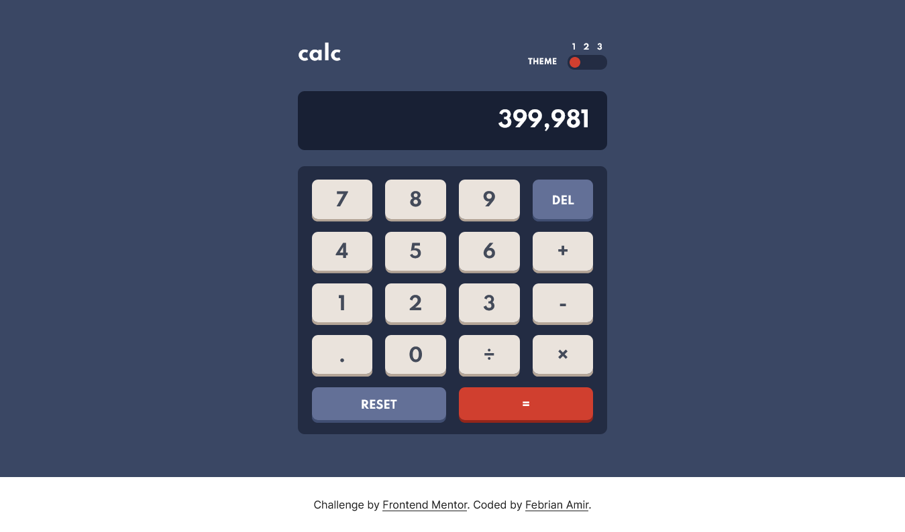
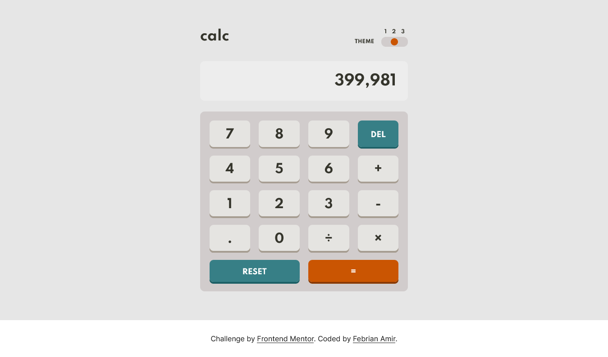
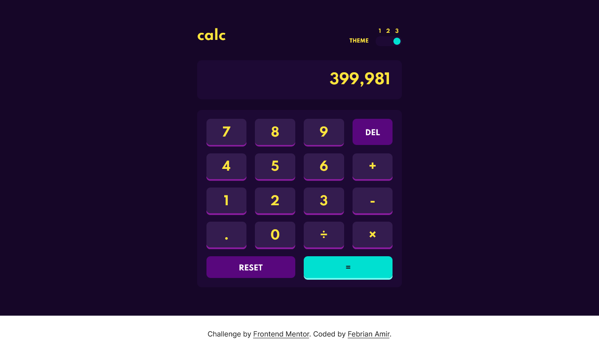

# Frontend Mentor - Calculator app solution

This is a solution to the [Calculator app challenge on Frontend Mentor](https://www.frontendmentor.io/challenges/calculator-app-9lteq5N29). Frontend Mentor challenges help you improve your coding skills by building realistic projects. 

## Table of contents

- [Overview](#overview)
  - [The challenge](#the-challenge)
  - [Screenshot](#screenshot)
  - [Links](#links)
- [My process](#my-process)
  - [Built with](#built-with)
  - [What I learned](#what-i-learned)
  - [Useful resources](#useful-resources)
- [Author](#author)

## Overview

### The challenge

Users should be able to:

- See the size of the elements adjust based on their device's screen size
- Perform mathmatical operations like addition, subtraction, multiplication, and division
- Adjust the color theme based on their preference
- **Bonus**: Have their initial theme preference checked using `prefers-color-scheme` and have any additional changes saved in the browser

### Screenshot





### Links

- Solution URL: [Solution URL](https://www.frontendmentor.io/solutions/calculator-app-with-grid-css-and-localstorage-l21K0-rvy)
- Live Site URL: [Live Site URL](https://quikzens.github.io/calculator-app)

## My process

### Built with

- Semantic HTML5 markup
- CSS custom properties
- Flexbox
- CSS Grid
- Mobile-first workflow
- LocalStorage

### What I learned

I learn about localStorage in this project

```js
localStorage.setItem('theme', 'one')
localStorage.getItem('theme')
```

### Useful resources

- [JavaScript toString() method](https://www.w3schools.com/jsref/jsref_tostring_string.asp)
- [localStorage](https://developer.mozilla.org/en-US/docs/Web/API/Window/localStorage)

## Author

- Website - [Febrian Amir](https://quikzens.netlify.app)
- Frontend Mentor - [@quikzens](https://www.frontendmentor.io/profile/daengkoding)
