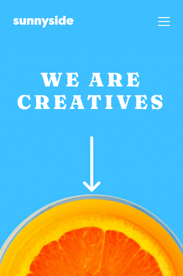
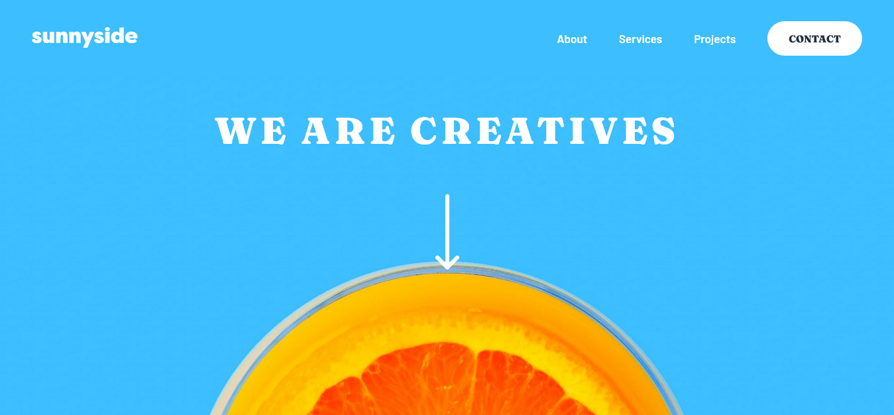

# Frontend Mentor - Sunnyside agency landing page solution

This is a solution to the [Sunnyside agency landing page challenge on Frontend Mentor](https://www.frontendmentor.io/challenges/sunnyside-agency-landing-page-7yVs3B6ef). Frontend Mentor challenges help you improve your coding skills by building realistic projects.

## Table of contents

- [Overview](#overview)
  - [The challenge](#the-challenge)
  - [Screenshot](#screenshot)
  - [Links](#links)
- [My process](#my-process)
  - [Built with](#built-with)
  - [What I learned](#what-i-learned)
  - [Continued development](#continued-development)
  - [Useful resources](#useful-resources)
- [Author](#author)

## Overview

### The challenge

Users should be able to:

- View the optimal layout for the site depending on their device's screen size
- See hover states for all interactive elements on the page

### Screenshot




### Links

- Solution URL: [Solution URL](https://www.frontendmentor.io/solutions/sunnyside-landing-page-with-flexbox-grid-and-media-queries-C-vtaFcsI)
- Live Site URL: [Live Site URL](https://quikzens.github.io/sunnyside-agency-landing-page/)

## My process

### Built with

- Semantic HTML5 markup
- CSS custom properties
- Flexbox
- CSS Grid
- Mobile-first workflow

### What I learned

Some of my major learnings while working through this project:

- Make triangle shape in CSS:

```css
.navbar__content::before {
  --size: 25px;
  content: '';
  position: absolute;
  top: -25px;
  right: 0;
  width: var(--size);
  height: var(--size);
  border-left: var(--size) solid transparent;
  border-bottom: var(--size) solid var(--white);
}
```

### Continued development

These are concepts i'm still not completely comfortable with:

- CSS Backgrounds

### Useful resources

- [Shapes of CSS | CSS Tricks](https://css-tricks.com/the-shapes-of-css/)
- [CSS Background Shorthand | w3schools](https://www.w3schools.com/css/css_background_shorthand.asp)

## Author

- Website - [Febrian Amir](https://quikzens.netlify.app)
- Frontend Mentor - [@quikzens](https://www.frontendmentor.io/profile/daengkoding)
